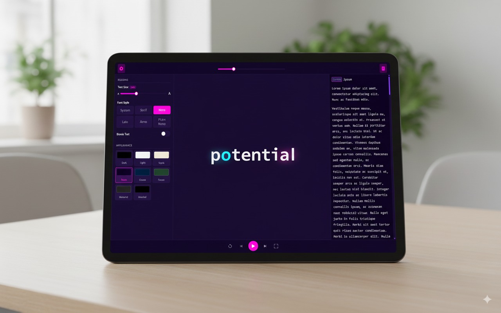
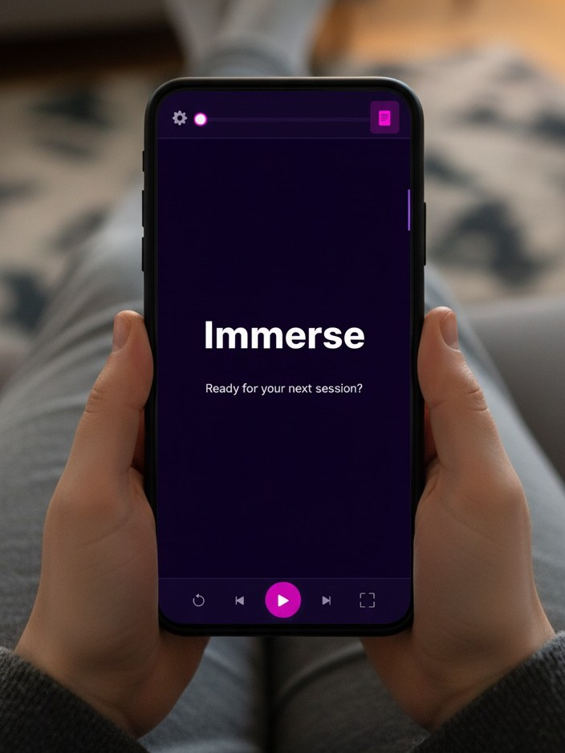

<<<<<<< HEAD
# RSVP Reader

**Unlock your reading potential. A fast, beautiful, and highly customizable RSVP speed-reading web application designed for focus, efficiency, and accessibility.**

Experience fast, private, and powerful speed reading—right in your browser. Just open and start reading instantly.

  
  

## Why Choose This Reader?

In a world of constant information, the ability to read efficiently is a superpower. Modern RSVP Reader is engineered to give you that power, whether you're a student, a professional, or simply a lifelong learner.

*   **Entirely Client-Side:** Your files are processed directly in your browser. Nothing is ever uploaded, ensuring your privacy is always protected.
*   **Broad File Support:** Effortlessly load and read `.txt`, `.pdf`, `.epub`, and `.docx` files.
*   **Highly Customizable:** Tailor your reading experience with adjustable WPM, text size, multiple fonts, and a variety of beautiful themes.
*   **Accessible by Design:** Features like Bionic Reading and RSVP are integrated to assist readers of all abilities, including those with dyslexia, ADHD, and other learning disabilities.
*   **Elegant & Modern UI:** A clean, intuitive, and responsive interface that gets out of your way and lets you focus on what matters: the text.

---

## The Science of Speed Reading

This application leverages two scientifically-backed reading methodologies to enhance focus and speed.

### Rapid Serial Visual Presentation (RSVP)

RSVP is a technique that presents words one at a time at a fixed focal point. This method can dramatically increase reading speed by eliminating subvocalization (the silent speech in your head) and saccadic eye movement (the micro-jumps your eyes make when reading).

**Benefits of RSVP:**
*   **Increased Speed:** By reducing unnecessary eye movement, you can process text at a much faster rate.
*   **Improved Focus:** Presenting one word at a time minimizes distractions and keeps your attention locked on the content.
*   **Reduced Mental Strain:** RSVP can help readers, especially those with dyslexia, by presenting information in manageable chunks, which may aid comprehension.

### Bionic Reading

Bionic Reading is a newer methodology that guides the eyes through text by bolding the initial letters of each word. This creates "artificial fixation points" that allow your brain to recognize words faster and fill in the rest, reducing cognitive load and improving reading flow.

**Benefits of Bionic Reading:**
*   **Enhanced Flow & Comprehension:** Many users report a smoother, less strenuous reading experience, which can lead to better understanding.
*   **A Powerful Tool for Neurodiversity:** Individuals with **ADHD** often find that Bionic Reading helps maintain focus and engagement with the text. For those with **dyslexia**, it can help the eyes move from one bolded section to the next, preventing getting "stuck" on individual words.

While the scientific community is still exploring the full extent of these benefits, anecdotal evidence and preliminary studies suggest that these methods can be game-changers for many readers.

---

## Features

*   **Adjustable Speed:** Control your reading pace from a leisurely 50 WPM to a lightning-fast 1200 WPM with a smooth slider.
*   **Multiple Themes:** Choose from Dark, Light, Sepia, Neon, Ocean, and more to find the perfect reading environment for your eyes.
*   **Font Customization:** Select from a range of sans-serif, serif, and monospace fonts to suit your preference.
*   **Text Size Control:** Easily adjust the size of the displayed word for optimal comfort.
*   **Bionic Text Toggle:** Switch Bionic Reading on or off with a single click.
*   **Full Document Viewer:** A collapsible panel displays the full text of your document, with the current word automatically highlighted and scrolled into view.
*   **Interactive Text:** Click on any word in the document viewer to instantly jump to that position in the RSVP reader.
*   **Fullscreen Mode:** Immerse yourself completely with a distraction-free fullscreen reading experience.
*   **Responsive Design:** Enjoy a seamless experience on any device, from desktops to tablets and mobile phones.
*   **Keyboard Shortcuts:** Control playback, navigation, and UI panels with intuitive keyboard shortcuts.

## Controls & Shortcuts

Master the reader with these simple on-screen controls and keyboard shortcuts.

### On-Screen Controls

*   **Top Bar:**
    *   **Gear Icon:** Toggles the settings panel (WPM, font, themes, etc.).
    *   **WPM Slider:** Adjusts the reading speed in Words Per Minute.
    *   **File Icon:** Toggles the full document viewer panel.
*   **Bottom Bar:**
    *   **Restart Button:** Jumps back to the beginning of the text.
    *   **Previous Word Button:** Moves one word backward.
    *   **Play/Pause Button:** Starts or stops the RSVP reading.
    *   **Next Word Button:** Moves one word forward.
    *   **Fullscreen Button:** Enters or exits the immersive fullscreen mode.

### Keyboard Shortcuts

| Key(s) | Action |
| :--- | :--- |
| `Spacebar` | Play / Pause Reading |
| `ArrowLeft` | Previous Word |
| `ArrowRight`| Next Word |
| `Home` | Restart from Beginning |
| `F` or `f` | Toggle Fullscreen Mode |
| `S` or `s` | Toggle Settings Panel |
| `D` or `d` | Toggle Document View Panel |
| `Escape` | Exit Fullscreen Mode |

---

## Technology Stack

This project is intentionally built with simplicity and portability in mind. It's a "zero-dependency" application in the sense that you don't need `npm`, build steps, or a server to run it.

*   **HTML5, CSS3, and Vanilla JavaScript (ES6+):** The core of the application is built with modern, framework-free web standards for maximum performance and compatibility.
*   **CSS Custom Properties (Variables):** Used extensively for powerful theming and easy customization of the UI.

### External Libraries

To handle complex file parsing, the application loads the following battle-tested, open-source libraries from a CDN:

*   **[PDF.js](https://mozilla.github.io/pdf.js/) (by Mozilla):** Used to parse and extract text content from PDF files directly in the browser.
*   **[ePub.js](https://github.com/futurepress/epub.js/)**: A comprehensive library for rendering and parsing `.epub` files, with a dependency on **JSZip** for unzipping the book content.
*   **[Mammoth.js](https://github.com/mwilliamson/mammoth.js)**: A lightweight library for converting `.docx` (Microsoft Word) files into clean HTML and extracting raw text.
*   **[Bootstrap Icons](https://icons.getbootstrap.com/)**: Provides the clean and modern icon set used throughout the user interface.

## Contributing

We welcome contributions of all kinds! Whether it's reporting a bug, suggesting a new feature, or submitting a pull request, your input is valued. Please feel free to open an issue to start a discussion.

---

## References

 **Rapid Serial Visual Presentation** - Wikipedia. [https://en.wikipedia.org/wiki/Rapid_serial_visual_presentation](https://en.wikipedia.org/wiki/Rapid_serial_visual_presentation)

 **Bionic Reading®** - The official Bionic Reading website. [https://bionic-reading.com/](https://bionic-reading.com/)
=======
# rasvip
 A modern, client-side speed reader using RSVP and Bionic Reading to boost your focus and reading speed.
>>>>>>> 9ce8e96404b4f04e7466aa056de37c5b876a8c16
